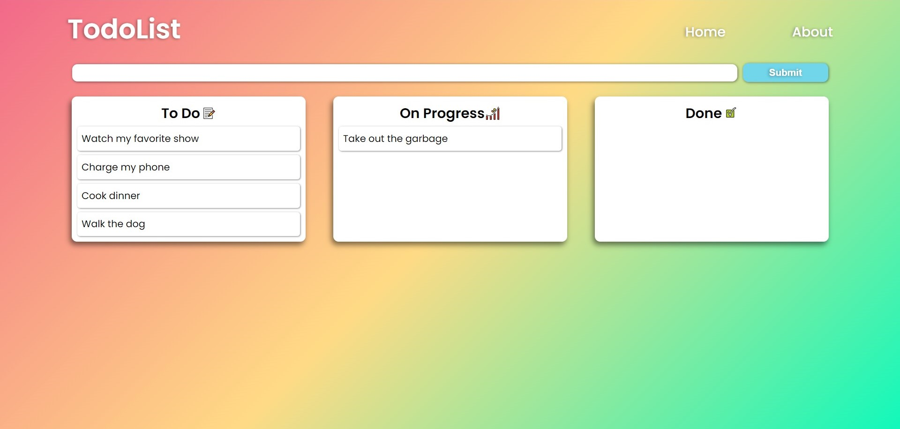

## GameStore App

*  [Setup](#setup)

*  [General info](#general-info)

*  [Technologies](#technologies)

  

## Setup

To run this project, install it locally using npm:

  

```

$ cd ../project_folder

$ npm install

$ npm start

```

## General info

This app lets you create a todo, change its state to 'In Progress' or 'Completed' columns with Drag and Drop components and Re-arrenge them in his own column!



## Technologies

Project is created with:

* ReactJS
* React Router
* React Beautiful DND
* Context-Api
* Styled Components
